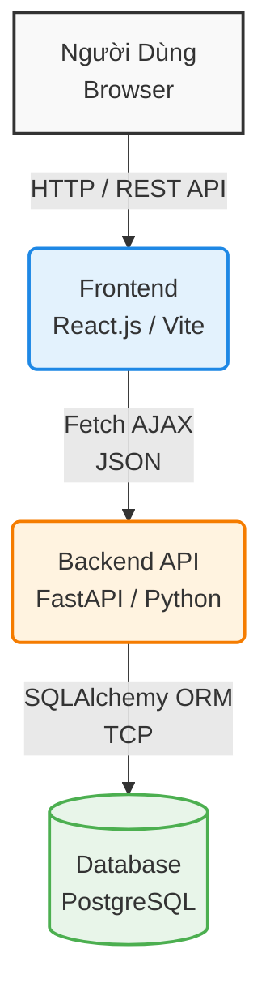
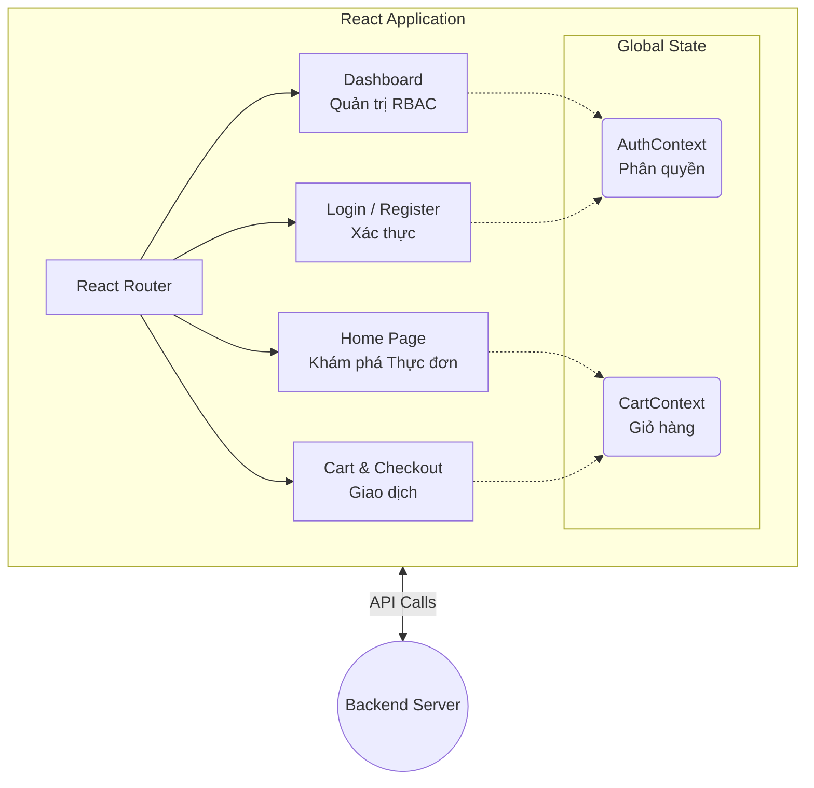
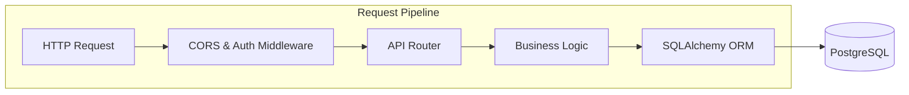
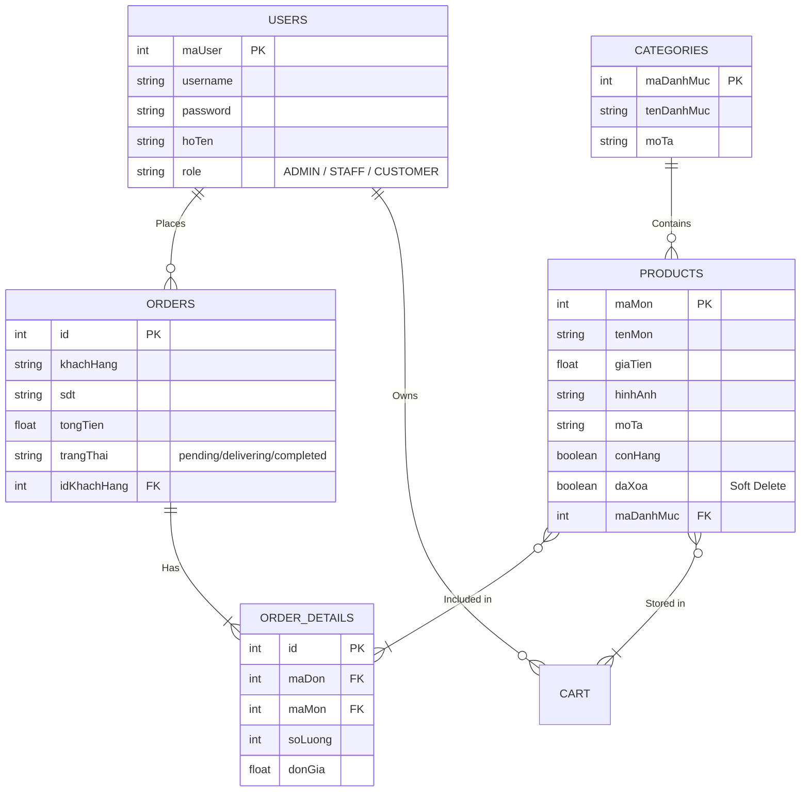

# System Architecture: Food Ordering System

Tài liệu này mô tả kiến trúc tổng thể của hệ thống Đặt Đồ Ăn (Food Ordering System). Hệ thống được thiết kế theo mô hình Client-Server với sự phân tách rõ ràng giữa Frontend (React) và Backend (FastAPI), đi kèm hệ quản trị cơ sở dữ liệu quan hệ PostgreSQL.

---

## 1. High-Level Architecture (Kiến trúc Tổng thể)

Luồng hoạt động chính bao gồm Người dùng (Khách hàng hoặc Quản trị viên) tương tác với Giao diện Web (Frontend). Giao diện gửi các yêu cầu HTTP thông qua API đến Máy chủ (Backend), nơi xử lý nghiệp vụ logic và đọc/ghi dữ liệu vào Hệ Quản trị Cơ sở dữ liệu (PostgreSQL).

---

## 2. Frontend Architecture (React.js)

Kiến trúc phần giao diện được tổ chức theo cấu trúc Single Page Application (SPA), sử dụng **Context API** làm trung tâm lưu trữ State cục bộ giúp luân chuyển dữ liệu xuyên suốt các trang.

- **Routing:** Quản lý bằng `react-router-dom` giúp việc chuyển trang không cần reset tải lại toàn bộ tài nguyên.
- **State Management:**
  - `AuthContext`: Quản lý tình trạng đăng nhập, thông tin `user` hiện tại và xử lý phân quyền (RBAC).
  - `CartContext`: Quản lý logic Giỏ hàng và đồng bộ tổng tiền trước khi ra quyết định Thanh Toán (Checkout).
- **Libraries:** Sử dụng CSS Inline kết hợp thư viện `react-toastify` để cung cấp phản hồi thông báo UI độc lập. Dữ liệu báo cáo trên Admin được biểu đồ hóa thông qua `recharts` và xuất nhờ thư viện `xlsx`.

---

## 3. Backend Architecture (FastAPI)

Ứng dụng backend được tổ chức theo hình thức Module hóa mạnh (thông qua `APIRouter`), tập trung vào luồng xử lý REST. Mỗi endpoint được khai báo rõ ràng phương thức, schema đầu vào/đầu ra và bảo vệ tính toàn vẹn (Validation) thông qua thư viện `Pydantic`.

- **Core/Server:** Môi trường ảo chứa ứng dụng chạy trên `Uvicorn` server xử lý đa luồng ASGI bất đồng bộ chuyên nghiệp. 
- **Routers:**
  - `auth.py`: Xử lý phân giải Token JWT (đã nâng cấp mock tại FE) và tạo User.
  - `category.py`: CRUD dữ liệu liên quan đến Danh mục.
  - `product.py`: CRUD quản lý Sản phẩm/Thực đơn, xử lý tệp tĩnh (Tải ảnh Upload).
  - `order.py`: Xử lý tạo và thay đổi chu kỳ hoàn tất tiến trình đơn hàng (Pipeline Trạng thái).
- **Data Layer:** 
  - `database.py`: Quản lý chuỗi kết nối và tạo Engine giao tiếp tới `PostgreSQL`.
  - `models.py`: Khai báo bảng lược đồ tương tác.
  - `schemas.py`: Định nghĩa các cấu trúc JSON (Pydantic model) ra/vào API.

---

## 4. Entity Relationship Diagram (ERD Lược đồ Dữ liệu)

Chi tiết cấu trúc mô hình (Schema) và mối liên kết quan hệ 1-Nhiều hoặc Nhiều-Nhiều bên trong thiết kế SQL của hệ thống.

---

## 5. Security & Deployment Focus

1. **Authentication:** 
   - Backend sử dụng JWT (JSON Web Tokens) đính kèm trên Authorization Bearer Headers để xử lý bảo mật phía Server API.
   - Các mật khẩu được dùng thuật toán một chiều `bcrypt` để tạo hash salt bảo vệ Dữ liệu mật trong DB.
2. **Soft Delete Concept:**
   - Hệ thống được trang bị "Thùng Rác" với cờ cắm `daXoa = True` cho món ăn. Điều này đảm bảo lịch sử báo cáo dòng tiền ở quá khứ không bị lệch lệch nhịp (data consistency cascade rule) nếu vô tình xóa mất một món ăn vĩnh viễn khỏi Database.
3. **Mô hình Khởi Chạy (Deployment):**
   - Đã được chuẩn bị sẵn các Port như `8000` (FastAPI) và `5173` (Vite dev server) thông suốt qua cấu hình CORS từ Backend. Có thể đóng gói thông qua Docker hoặc Publish lên nền tảng như Render/Vercel dễ dàng.
